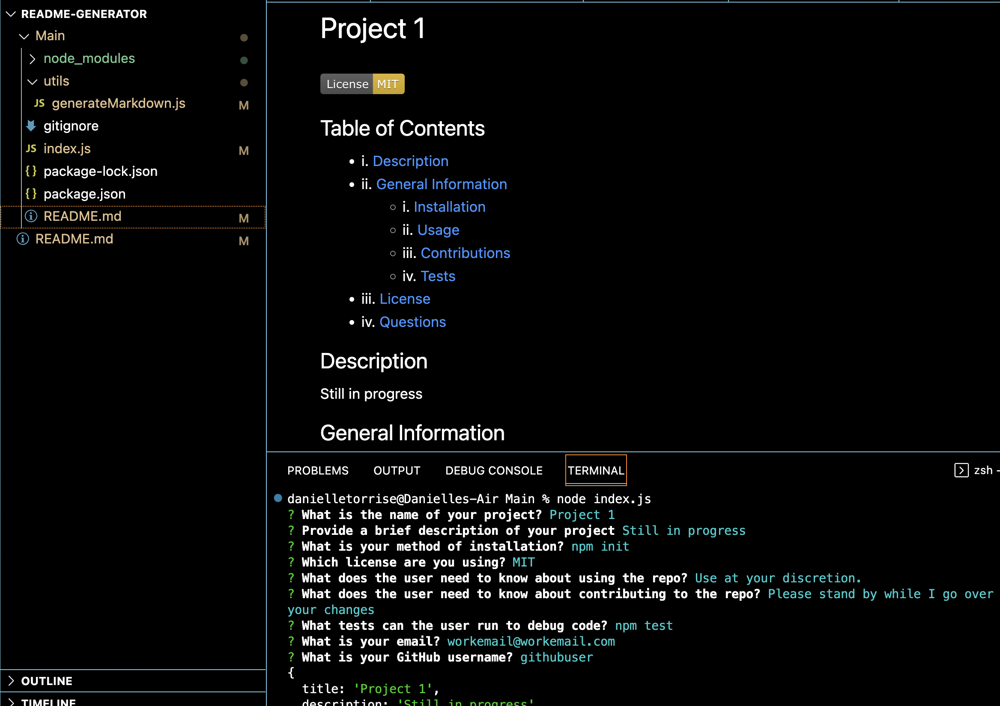

# README Generator

## Description

This is a README.md generator that uses Node js and the Inquirer Library Module. You type in the name, license, and more of your project and it will generate a README.md for you. 

## Screenshot

Here is a screenshot of an example output of the application

## Demo

The following is a demo that I made walking through the code and functionality of this application:

https://user-images.githubusercontent.com/24580349/216782493-ead92c33-81f8-4868-a522-d04399e17e98.mp4

[Clickable link here](https://watch.screencastify.com/v/LiZqSA1EWyN9TIukXeWq)
